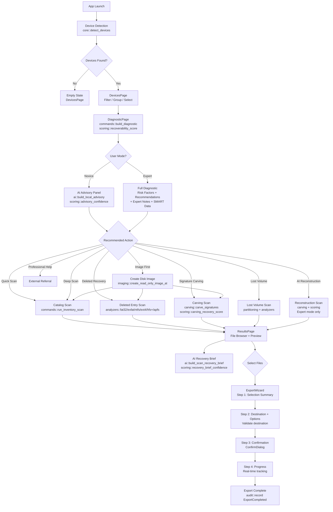
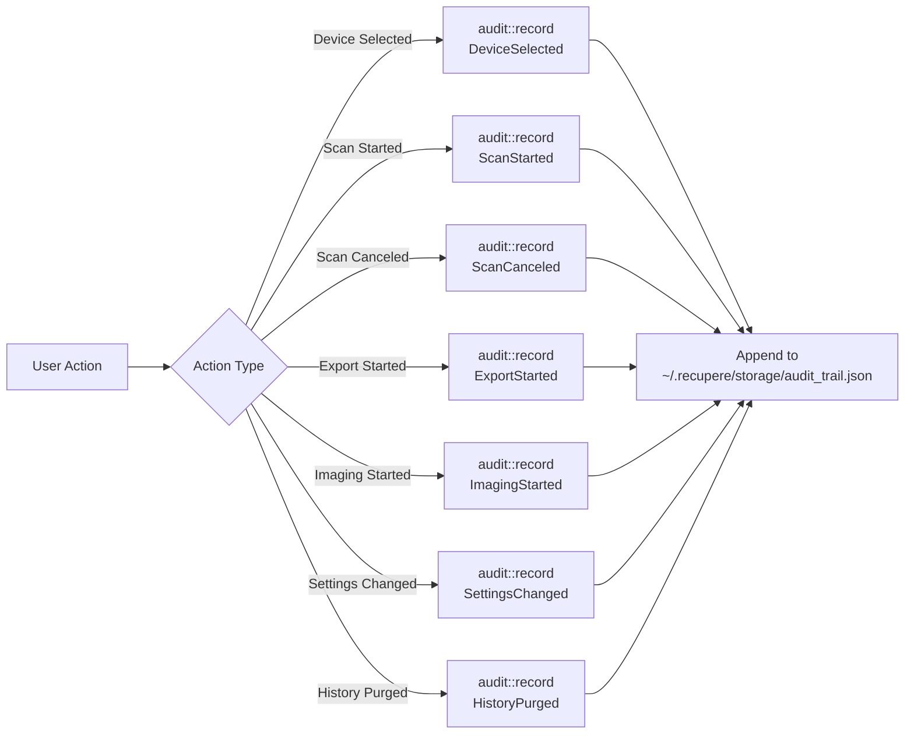
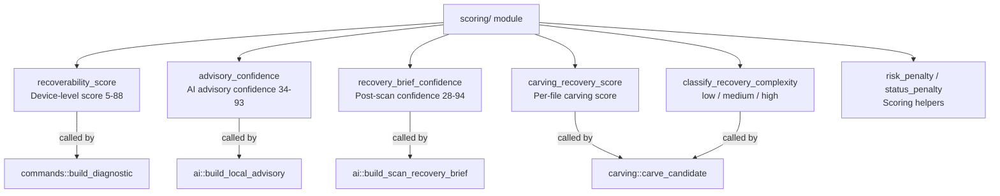
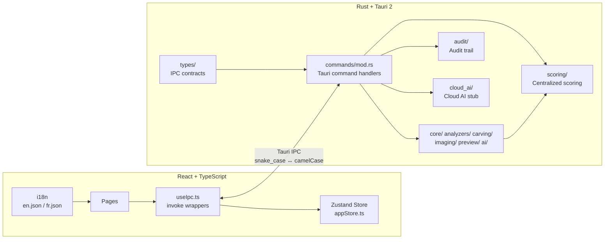
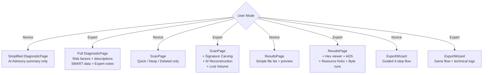

# Recupere — Application Flow Diagram

## Main Recovery Flow

```mermaid
flowchart TD
    A[App Launch] --> B[Device Detection<br/>core::detect_devices]
    B --> C{Devices Found?}
    C -->|No| D[Empty State<br/>DevicesPage]
    C -->|Yes| E[DevicesPage<br/>Filter / Group / Select]

    E --> F[DiagnosticPage<br/>commands::build_diagnostic<br/>scoring::recoverability_score]

    F --> G{User Mode?}
    G -->|Novice| H[AI Advisory Panel<br/>ai::build_local_advisory<br/>scoring::advisory_confidence]
    G -->|Expert| I[Full Diagnostic<br/>Risk Factors + Recommendations<br/>+ Expert Notes + SMART Data]

    H --> J{Recommended Action}
    I --> J

    J -->|Image First| K[Create Disk Image<br/>imaging::create_read_only_image_at]
    J -->|Quick Scan| L[Catalog Scan<br/>commands::run_inventory_scan]
    J -->|Deep Scan| L
    J -->|Deleted Recovery| M[Deleted Entry Scan<br/>analyzers::fat32/exfat/ntfs/ext4/hfs+/apfs]
    J -->|Signature Carving| N[Carving Scan<br/>carving::carve_signatures<br/>scoring::carving_recovery_score]
    J -->|Lost Volume| O[Lost Volume Scan<br/>partitioning + analyzers]
    J -->|AI Reconstruction| P[Reconstruction Scan<br/>carving + scoring<br/>Expert mode only]
    J -->|Professional Help| Q[External Referral]

    K --> M
    K --> N
    K --> L

    L --> R[ResultsPage<br/>File Browser + Preview]
    M --> R
    N --> R
    O --> R
    P --> R

    R --> S[AI Recovery Brief<br/>ai::build_scan_recovery_brief<br/>scoring::recovery_brief_confidence]
    R --> T{Select Files}

    T --> U[ExportWizard<br/>Step 1: Selection Summary]
    U --> V[Step 2: Destination + Options<br/>Validate destination]
    V --> W[Step 3: Confirmation<br/>ConfirmDialog]
    W --> X[Step 4: Progress<br/>Real-time tracking]
    X --> Y[Export Complete<br/>audit::record ExportCompleted]
```

## Audit Trail Flow

```mermaid
flowchart LR
    A[User Action] --> B{Action Type}
    B -->|Device Selected| C[audit::record<br/>DeviceSelected]
    B -->|Scan Started| D[audit::record<br/>ScanStarted]
    B -->|Scan Canceled| E[audit::record<br/>ScanCanceled]
    B -->|Export Started| F[audit::record<br/>ExportStarted]
    B -->|Imaging Started| G[audit::record<br/>ImagingStarted]
    B -->|Settings Changed| H[audit::record<br/>SettingsChanged]
    B -->|History Purged| I[audit::record<br/>HistoryPurged]

    C & D & E & F & G & H & I --> J[Append to<br/>~/.recupere/storage/audit_trail.json]
```

## Scoring Module Interactions

```mermaid
flowchart TD
    S[scoring/ module] --> S1[recoverability_score<br/>Device-level score 5-88]
    S --> S2[advisory_confidence<br/>AI advisory confidence 34-93]
    S --> S3[recovery_brief_confidence<br/>Post-scan confidence 28-94]
    S --> S4[carving_recovery_score<br/>Per-file carving score]
    S --> S5[classify_recovery_complexity<br/>low / medium / high]
    S --> S6[risk_penalty / status_penalty<br/>Scoring helpers]

    S1 --> |called by| C1[commands::build_diagnostic]
    S2 --> |called by| C2[ai::build_local_advisory]
    S3 --> |called by| C3[ai::build_scan_recovery_brief]
    S4 --> |called by| C4[carving::carve_candidate]
    S5 --> |called by| C4
```

## Data Flow (IPC Bridge)

```mermaid
flowchart LR
    subgraph Frontend [React + TypeScript]
        A[Pages] --> B[useIpc.ts<br/>invoke wrappers]
        B --> C[Zustand Store<br/>appStore.ts]
        D[i18n<br/>en.json / fr.json] --> A
    end

    subgraph Backend [Rust + Tauri 2]
        E[commands/mod.rs<br/>Tauri command handlers]
        F[core/ analyzers/ carving/<br/>imaging/ preview/ ai/]
        G[scoring/<br/>Centralized scoring]
        H[audit/<br/>Audit trail]
        I[cloud_ai/<br/>Cloud AI stub]
        J[types/<br/>IPC contracts]
    end

    B <-->|Tauri IPC<br/>snake_case ↔ camelCase| E
    E --> F
    E --> G
    E --> H
    E --> I
    F --> G
    J --> E
```

## Novice vs Expert Decision Points

```mermaid
flowchart TD
    M{User Mode} -->|Novice| N1[Simplified DiagnosticPage<br/>AI Advisory summary only]
    M -->|Expert| E1[Full DiagnosticPage<br/>Risk factors + descriptions<br/>SMART data + Expert notes]

    M -->|Novice| N2[ScanPage<br/>Quick / Deep / Deleted only]
    M -->|Expert| E2[ScanPage<br/>+ Signature Carving<br/>+ AI Reconstruction<br/>+ Lost Volume]

    M -->|Novice| N3[ResultsPage<br/>Simple file list + preview]
    M -->|Expert| E3[ResultsPage<br/>+ Hex viewer + ADS<br/>+ Resource forks + Byte runs]

    M -->|Novice| N4[ExportWizard<br/>Guided 4-step flow]
    M -->|Expert| E4[ExportWizard<br/>Same flow + technical logs]
```
